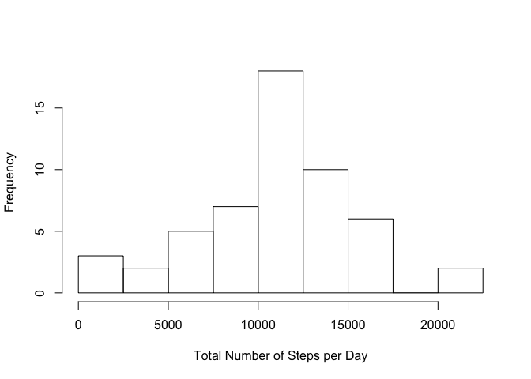
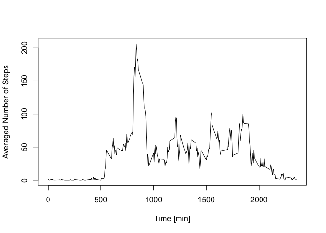
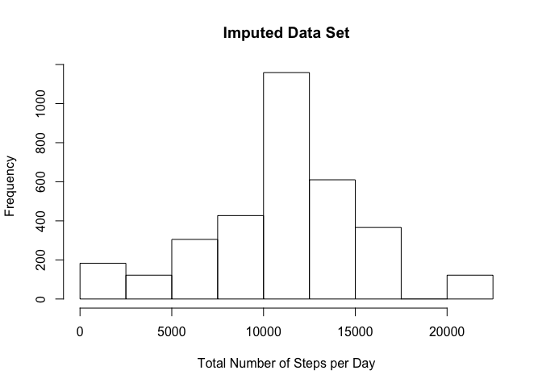
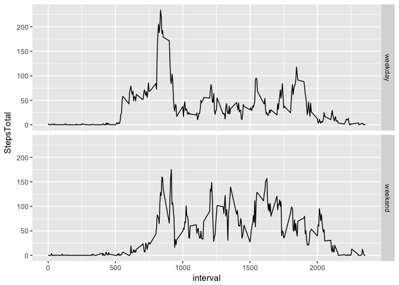

# ActivityDataProject
LAMrRau  
8/2/2017  

## Loading and preprocessing the data

Make sure that the working directory is set correctly w.r.t. the data file 'activity.csv'.


```r
unzip("activity.zip", overwrite = TRUE)
myData <- read.csv("activity.csv")
```

So far, no preprocessing necessary!

## T1: What is mean total number of steps taken per day?

The following code snippet sums the steps by day and plots the data.


```r
library("dplyr")
p1Data <- myData %>% group_by(date) %>% mutate(stepsTotal = sum(steps))
p1Data <- unique(data.frame(date = as.Date(as.character(p1Data$date), "%Y-%m-%d"), stepsTotal = p1Data$stepsTotal))
hist(p1Data$stepsTotal, xlab="Total Number of Steps per Day", main = "", breaks=seq(0,22500,by=2500))
```

<!-- -->

The mean value of the total steps per day is 1.0766189\times 10^{4}

The median value of the total steps per day is 10765

## T2: What is the average daily activity pattern?

The following code snippet averages the steps by interval and plots the data.


```r
p2Data <- myData %>% group_by(interval) %>% mutate(stepsIntervalAverage = mean(steps, na.rm=TRUE))
p2Data <- unique(data.frame(interval = p2Data$interval, stepsIntervalAverage = p2Data$stepsIntervalAverage))
plot(x=p2Data$interval, y=p2Data$stepsIntervalAverage, type="l", xlab="Time [min]", ylab="Averaged Number of Steps")
```

<!-- -->

The maximum activity of 206.1698113 happens in the interval of minute 835!

## T3: Imputing missing values

The data set has 2304 missing values for the steps column.

The missing values shall be substituted with the interval averages calculated in section T2:


```r
p3Data <- myData
sum(is.na(p3Data$steps))
```

```
## [1] 2304
```

```r
for (indx in 1:length(myData$steps)){
   if ( is.na(p3Data$steps[indx]) ){
      p3Data$steps[indx] <- p2Data$stepsIntervalAverage[which(p2Data$interval == myData$interval[indx])]
   }
}
```

The data frame from p3Data will now be used to reproduce the plot from section T1:


```r
p3Data <- p3Data %>% group_by(date) %>% mutate(stepsTotal = sum(steps))
p3Data <- unique(data.frame(date = as.Date(as.character(p1Data$date), "%Y-%m-%d"), stepsTotal = p3Data$stepsTotal))
hist(p3Data$stepsTotal, xlab="Total Number of Steps per Day", main = "Imputed Data Set", breaks=seq(0,22500,by=2500))
```

<!-- -->

The mean value of the total steps per day is 1.0766189\times 10^{4}

The median value of the total steps per day is 1.0765594\times 10^{4}

The influence of this impution seems to be subtle. This is because the missing values were substituted with the average values.

## T4: Are there differences in activity patterns between weekdays and weekends?


```r
library("ggplot2")
myFuncWeekday <- function( date ){
   nameDay <- weekdays(as.Date(as.character(date)))
   output <- rep("",length(date))
   for (indx in 1:length(date) ){
      if ( nameDay[indx] == "Saturday" | nameDay[indx] == "Sunday" ){
         output[indx] <- "weekend"
      } else {
         output[indx] <- "weekday"
      }
   }
   output
}
p4Data <- myData
p4Data <- p4Data %>% mutate(WeekDayEnd = as.factor(myFuncWeekday(date)))
p4Data <- p4Data %>% group_by(WeekDayEnd, interval) %>% mutate(StepsTotal = mean(steps, na.rm=TRUE))
p4Data <- unique( data.frame(interval = p4Data$interval, WeekDayEnd = p4Data$WeekDayEnd, StepsTotal = p4Data$StepsTotal) )
plot4 <- ggplot(p4Data, aes(interval, StepsTotal)) + geom_line() + facet_grid(WeekDayEnd ~ .)
plot4
```

<!-- -->

Yes, there are differences:

* Weekend days start later and last longer compared to weekdays
* On weekends the average activity seems higher (visual inspection only)

